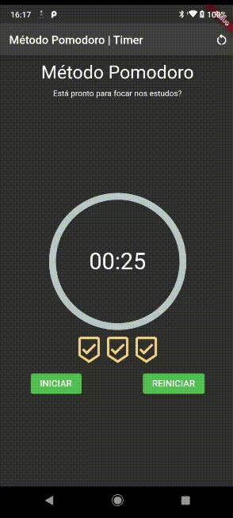

# LPRG3
Programação para Dispositivos Móveis

### Ambiente (LINUX)
 - [] Instalar o Android Studio. Ao instalar, também será instalado o Android SDK e o Android Tools para gerenciar as versões do SDK e o emulador do android (caso necessário).
 - [] Instalar o GIT: `sudo apt install git`
 - [] Configurar o GIT globalmente
    - `git config --global user.name SEU_NOME`
    - `git config --global user.email SEU_EMAIL`

## Projetos Práticos

Repositório utilizado para disponibilizar projetos básicos utilizando Flutter.

### #1 Ola Mundo

Primeiros passos com widgets, componentes stateless e statefull para introdução a biblioteca.

###### IMPORTANTE
 - Adicionar a biblioteca [`Flutter Icons`](https://pub.dev/packages/flutter_launcher_icons)
 - Rodar esse comando: `flutter pub run flutter_launcher_icons:main`
 - Alterar o nome do App em `android/app/src/main/AndroidManifest.xml`

### #2 Memory Game

Jogo da memória simples com flutter.

### #3 Memory Game

Metodologia de estudo Pomodoro para focar nos estudos intercalando com minutos de pausa para relaxar.

